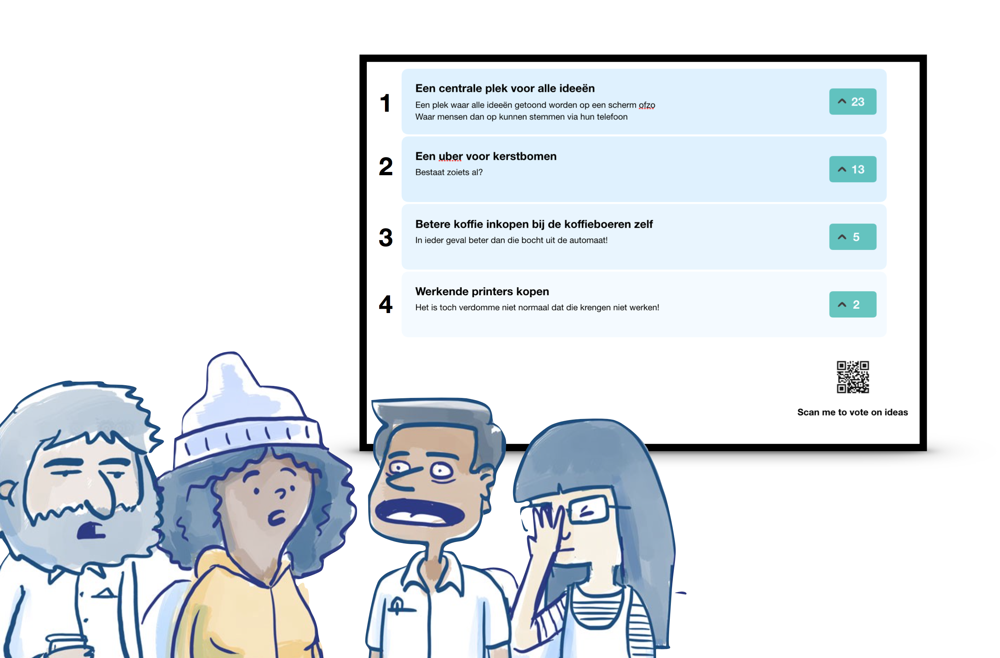

# PostIT
PostIT was developed as part of a school project. The goal was to develop a stable and usable application in a known programming language and toolset.

## The concept
PostIT provides a digital idea board for your organisation. You can create your own "space" on the app. Employees can visit your space by visiting the spaces' unique URL. On your organisations space, employees can upvote existing ideas without logging in. They can only vote once per idea however. An employee can login by entering their work e-mail. The administrator of the space can set the e-mail domains that the employee is allowed to register with. Logged in employees can post ideas and comments.

There is also a special viewing mode for public displays. All ideas of the organisation are shown. New ideas and comments ae highlighted on this view, upvotes get special attention as well.

With serviceworkers and web-push, web notifications are supported as well. These notifications can be turned on or off per organisation and are sent when new ideas or comments are posted to the organisations space.

## Toolstack
The PostIT client application was developed in React + Redux for state management. The backend was developed in NodeJS + Express, combined with the ws library for Websockets integration.

# The original assignment in Dutch

Op een kantoor bij **verborgen** hebben veel mensen ideeën, maar niet altijd een kanaal om deze te delen. Er zijn ook veel grote schermen beschikbaar. Maar deze worden nu niet echt zinnig gebruikt.
Om de ideeën te delen is er een concept bedacht. Een applicatie die op het scherm aangeeft welke verschillende ideeën er zijn. Daar kan je dan op stemmen door met je telefoon een QR-code of een pin in te toetsen op je telefoon.
Op je telefoon zou je dan ook nieuwe ideeën kunnen toevoegen.

## Opdrachtomschrijving
In eerste instantie is dit enkel en alleen een ideeënbord. Hier kan je inloggen met je telefoon en een idee kan posten, reageren op een idee van een ander, of upvoten van een ander idee.
Je moet op de hoogte gehouden kunnen worden van de veranderingen die zijn toegepast op je eigen ideeën, je eigen reacties etc.

## Realisatie
* Het moet meerdere borden kunnen ondersteunen
* Het idee moet deelbaar kunnen zijn op social media (of intern of extern)
* Push notifications op Android of in de Browser (met service workers)
* Offline first (werkt dus ook zonder internet, haalt nieuwe data op als die beschikbaar is)

## Onderzoek
Je zult moeten uitzoeken hoe je met behulp van service workers nieuwe data kan ophalen (op de achtergrond) en notificaties kan sturen op verschillende platforms.

Je moet een realtime applicatie bouwen. Dat doe je met Node/Express/Websockets en een MongoDB of Firebase Cloud Firestore als database. Kijk welke van de opties beter past bij de applicatie.
